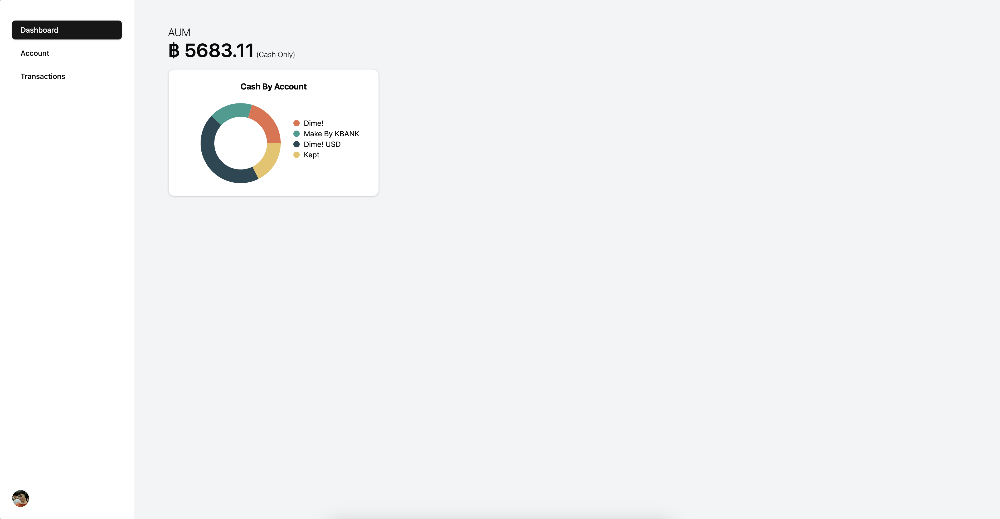
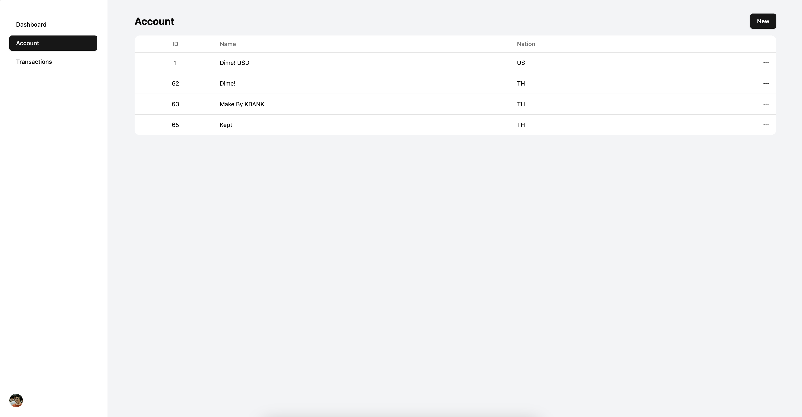
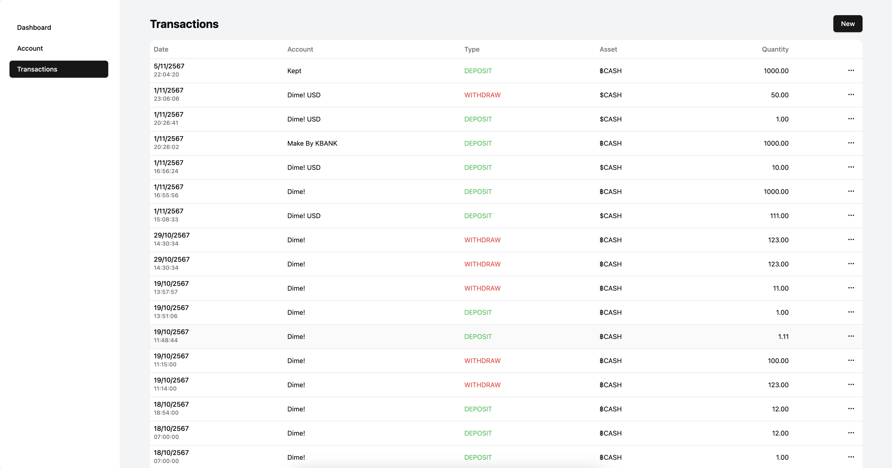
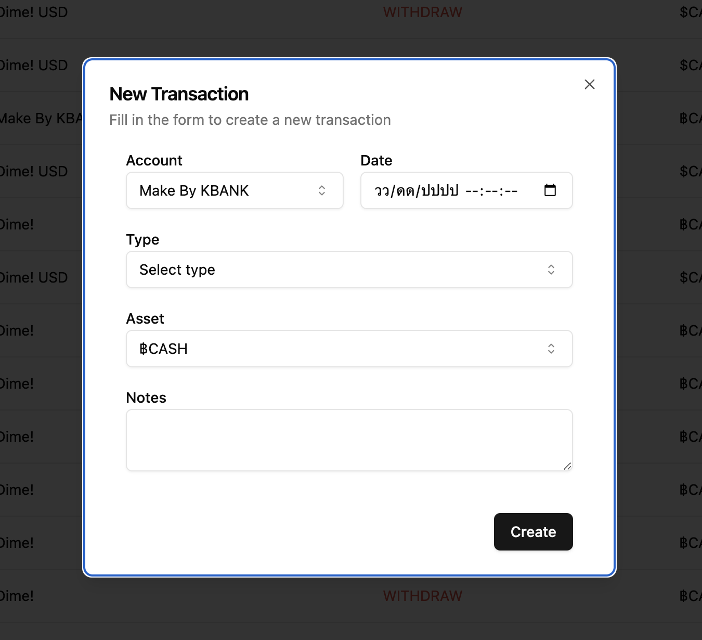

# Doi

Simple tracking income and expense application

## Screenshots




<div align="center">
  
</div>

## Tech stack

- ReactJS / Typescript + axios + shadcn/ui
- Go + Fiber + SQLc
- PostgreSQL

## Project Structure

`web/` -> client-side

## Run the project (development)

1. Setup locally PostgreSQL
2. Checkout `.env.example` and `Makefile`
3. Run

```
make dev
```

additional note: `POSTGRES_DATA_PATH` in `.env` is used for start local postgres.
